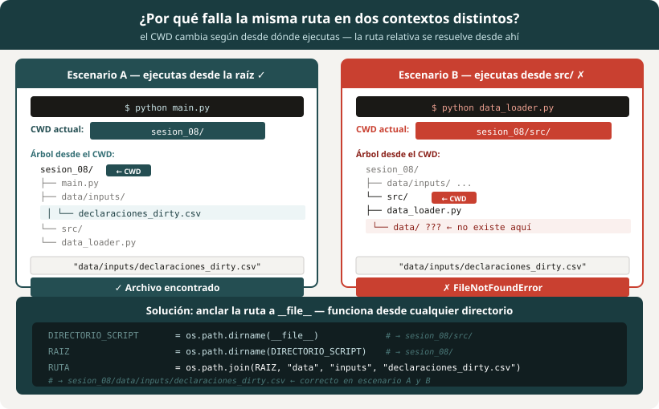
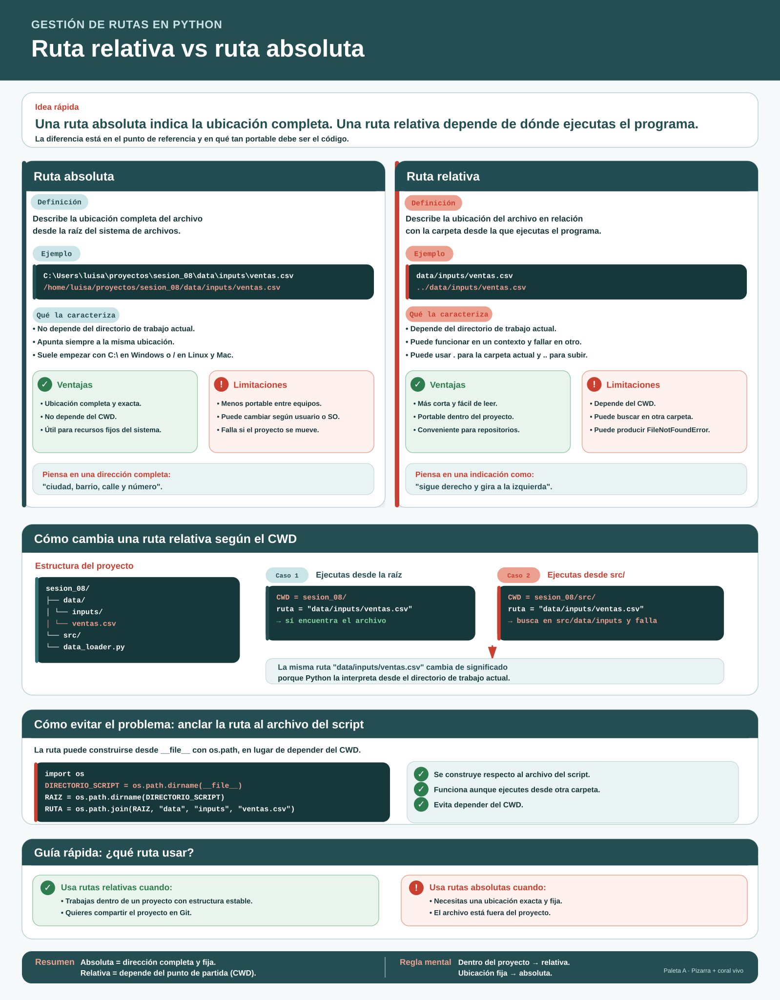
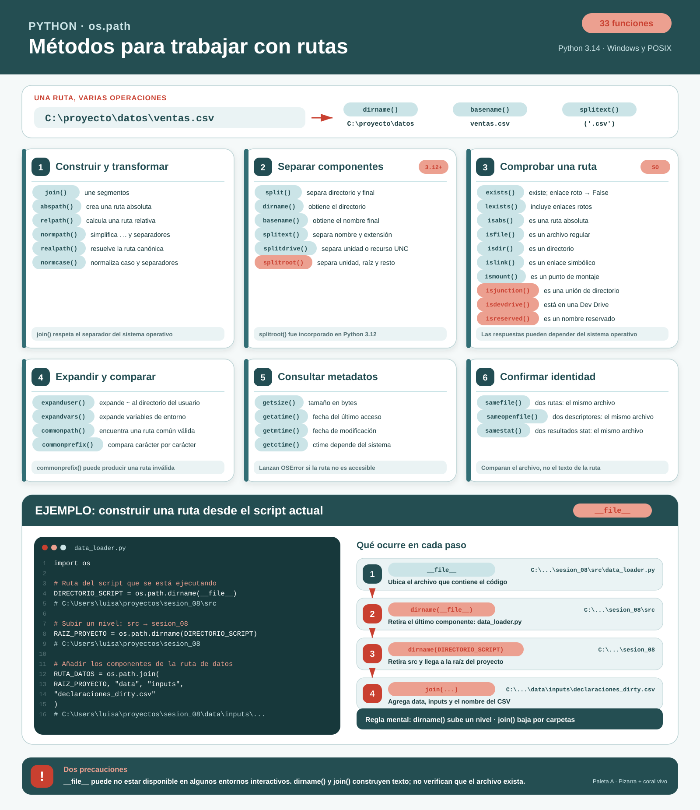
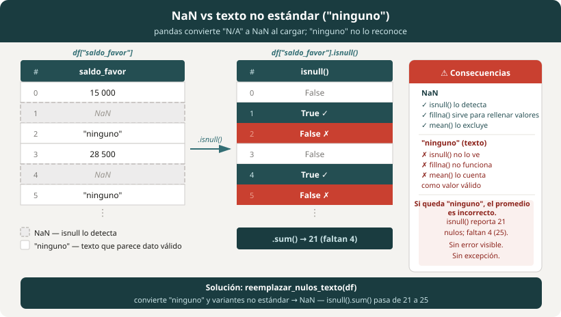
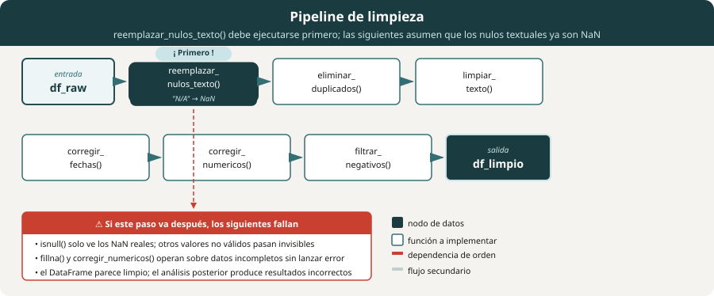

# Sesión 8 — Pandas III: Limpieza e integración de fuentes externas

**Curso:** Python Intermedio para Análisis de Datos — DIAN 2026
**Resultado de aprendizaje:** RA 3 — Aplica un flujo de procesamiento de datos
en Python mediante la integración de archivos planos y fuentes externas tipo
API y JSON, la limpieza y validación básica de datos heterogéneos, la
generación de salidas estructuradas.

---

## Índice

1. [Antes de empezar](#antes-de-empezar)
2. [Sección 0 — Gestión de rutas y archivos en Python](#sección-0--gestión-de-rutas-y-archivos-en-python)
3. [Sección 1 — Diagnóstico de calidad de datos](#sección-1--diagnóstico-de-calidad-de-datos)
4. [Sección 2 — Limpieza con `data_cleaner.py`](#sección-2--limpieza-con-data_cleanerpy)
5. [Sección 3 — Integración de fuente externa con `api_client.py`](#sección-3--integración-de-fuente-externa-con-api_clientpy)
6. [Sección 4 — Exportación consolidada](#sección-4--exportación-consolidada)
7. [Referencias](#referencias)

---

## Antes de empezar

Acepta la actividad en GitHub Classroom y abre el repositorio en Codespaces
o en tu entorno local con Visual Studio Code.

### Crear y activar el ambiente virtual

```bash
# Crear el ambiente virtual dentro del repositorio
python -m venv venv
```

```bash
# Activar en Windows
venv\Scripts\activate

# Activar en Mac o Linux
source venv/bin/activate
```

Cuando el ambiente está activo, el nombre `(venv)` aparece al inicio de la
línea del terminal. Todos los comandos siguientes deben ejecutarse con el
ambiente activo.

### Instalar las dependencias

```bash
pip install -r requirements.txt
```

El archivo `requirements.txt` incluye `pandas`, `openpyxl`, `numpy` y
`requests`. 

### Verificar la instalación

Crea un archivo `verificar.py` en la raíz del proyecto con este contenido:

```python
import pandas
import requests

print("Todo instalado correctamente")
```

Ejecútalo:

```bash
python verificar.py
```

```
Todo instalado correctamente
```

### Estructura del repositorio

```
sesion_08/
├── main.py                ← orquestador del menú (lo construyes tú)
├── requirements.txt
├── data/
│   ├── inputs/
│   │   └── declaraciones_dirty.csv
│   └── outputs/           ← los archivos exportados llegan aquí
├── src/                   ← archivos de trabajo del estudiante
│   ├── data_loader.py     ← funciones de carga y diagnóstico (completo)
│   ├── data_cleaner.py    ← funciones de limpieza (las implementas tú)
│   ├── api_client.py      ← funciones de API (implementas una)
│   └── data_exporter.py   ← funciones de exportación (completo)
└── solucion/              ← referencia: consúltala solo si te bloqueas
    ├── data_loader.py
    ├── data_cleaner.py
    ├── api_client.py
    ├── data_exporter.py
    ├── main.py
    └── explorar_rutas_solved.py
```

> 💡 **Cómo usar `solucion/`:** intenta resolver cada función por tu cuenta en
> `src/` y `main.py`. La carpeta `solucion/` tiene la implementación completa
> por si te atascas; en la guía también encontrarás cada solución oculta bajo
> un bloque "Ver solución".

---

## Sección 0 — Gestión de rutas y archivos en Python

Tu programa necesita saber dónde
están los archivos. Parece trivial —es solo una cadena de texto— hasta el
momento en que el script funciona en tu computador y falla en el de tu
compañero, o funciona cuando lo ejecutas desde el terminal y falla cuando lo
ejecutas desde VS Code. El origen de esos fallos normalmente es una
ruta que asume un directorio de trabajo que no es el que Python tiene en el
momento de ejecutar el código.



### Rutas absolutas y rutas relativas

Una **ruta absoluta** describe la ubicación completa de un archivo desde la
raíz del sistema de archivos. No depende de dónde estés ejecutando el
programa.

```python
# Ruta absoluta en Windows
ruta = "C:/Users/luisa/proyectos/sesion_08/data/inputs/declaraciones_dirty.csv"

# Ruta absoluta en Linux o Mac
ruta = "/home/luisa/proyectos/sesion_08/data/inputs/declaraciones_dirty.csv"
```

Una **ruta relativa** describe la ubicación de un archivo en relación al
**directorio de trabajo actual** (CWD, *Current Working Directory*): el
directorio desde el que Python está ejecutando el código en ese momento.

```python
# Ruta relativa: funciona solo si el CWD es la raíz del proyecto
ruta = "data/inputs/declaraciones_dirty.csv"
```

El directorio de trabajo actual no siempre es el que esperas. Depende de
desde dónde ejecutas el script.




```python
import os

print(os.getcwd())
# Si ejecutas `python main.py` desde la raíz del proyecto podría ser por ejemplo:
# → C:\Users\luisa\proyectos\sesion_08

# Si ejecutas `python main.py` desde la carpeta src/:
# → C:\Users\luisa\proyectos\sesion_08\src
# En ese caso, "data/inputs/declaraciones_dirty.csv" no existe relativo a
# ese directorio, y obtendrás un FileNotFoundError
```

> ⚠️ **Error frecuente:** una ruta relativa que funciona cuando ejecutas
> el script desde el terminal falla cuando lo ejecutas desde VS Code, porque
> VS Code puede tener configurado un CWD distinto. La forma de identificarlo es un
> `FileNotFoundError` que aparece en un entorno pero no en otro.

### Navegar entre directorios con `..`

Dentro de una ruta relativa, `.` representa el directorio actual y `..`
representa el directorio padre (un nivel hacia arriba). Puedes encadenarlos
para subir varios niveles.

```
sesion_08/          ← raíz del proyecto
├── src/
│   └── data_loader.py   ← estás aquí
└── data/
    └── inputs/
        └── declaraciones_dirty.csv   ← quieres llegar aquí
```

Desde `src/data_loader.py`, la ruta relativa al CSV es:

```python
# Subir un nivel (src/ → sesion_08/) y bajar a data/inputs/
ruta = "../data/inputs/declaraciones_dirty.csv"
```

Cada `..` sube un nivel. Si el archivo objetivo estuviera dos niveles arriba,
usarías `../../`:

```python
# Subir dos niveles y bajar a otra carpeta
ruta = "../../otro_proyecto/datos/archivo.csv"
```

En la práctica, `..` funciona cuando sabes desde qué directorio se ejecutará
el script y esa relación no cambia. Pero en este proyecto, `data_loader.py`
puede ejecutarse tanto desde la raíz (`python src/data_loader.py`) como desde
dentro de `src/` (`python data_loader.py`), y la ruta correcta es distinta
en cada caso.

La solución que funciona en ambos contextos es anclar la ruta al archivo
con `__file__`, que verás en la sección siguiente.

### `os.path`: construir rutas de forma segura

El módulo `os.path` resuelve el problema de las rutas de dos maneras:
construyéndolas con `join()` (que usa el separador correcto según el sistema
operativo) y anclándolas al script con `__file__`.

`os.path.join()` concatena componentes de ruta con el separador correcto
para el sistema operativo. En Windows usa `\`; en Linux y Mac usa `/`.

```python
import os

# Sin os.path.join: falla en Windows si usas /
ruta = "data" + "/" + "inputs" + "/" + "declaraciones_dirty.csv"

# Con os.path.join: funciona en cualquier sistema operativo
ruta = os.path.join("data", "inputs", "declaraciones_dirty.csv")
print(ruta)
# → data\inputs\declaraciones_dirty.csv  (Windows)
# → data/inputs/declaraciones_dirty.csv  (Linux / Mac)
```

Los métodos disponibles de `os.path` más útiles son:

```python
ruta = os.path.join("data", "inputs", "declaraciones_dirty.csv")

os.path.exists(ruta)          # True si el archivo o directorio existe
os.path.isfile(ruta)          # True si existe y es un archivo
os.path.isdir("data/inputs")  # True si existe y es un directorio
os.path.basename(ruta)        # → "declaraciones_dirty.csv"
os.path.dirname(ruta)         # → "data/inputs"
os.path.abspath(ruta)         # → ruta absoluta completa desde el CWD
```

```python
print(os.path.exists(ruta))   # True si el CSV ya está en esa ubicación
print(os.path.basename(ruta)) # → declaraciones_dirty.csv
print(os.path.abspath(ruta))
# → C:\Users\luisa\proyectos\sesion_08\data\inputs\declaraciones_dirty.csv
```

### Rutas robustas con `__file__`

La variable especial `__file__` contiene la ruta del script que se está
ejecutando en ese momento. Anclar las rutas a `__file__` hace que
funcionen independientemente del CWD.

```python
import os

# __file__ es la ruta del script actual, por ejemplo:
# C:\Users\luisa\proyectos\sesion_08\src\data_loader.py

DIRECTORIO_SCRIPT = os.path.dirname(__file__)
# → C:\Users\luisa\proyectos\sesion_08\src

RAIZ_PROYECTO = os.path.dirname(DIRECTORIO_SCRIPT)
# → C:\Users\luisa\proyectos\sesion_08

RUTA_DATOS = os.path.join(RAIZ_PROYECTO, "data", "inputs", "declaraciones_dirty.csv")
# → C:\Users\luisa\proyectos\sesion_08\data\inputs\declaraciones_dirty.csv
```

Esta ruta funciona igual sin importar desde dónde ejecutes el script, porque
no depende del CWD: depende de la ubicación del propio archivo.

La siguiente figura presenta los métodos más importantes de os.path



### Crear directorios con `os.makedirs()`

Antes de exportar un archivo a una carpeta, esa carpeta tiene que existir.
`os.makedirs()` la crea si no existe, incluidos todos los directorios
intermedios necesarios.

```python
import os

os.makedirs("data/outputs", exist_ok=True)
```

El parámetro `exist_ok=True` evita que la función lance error si la carpeta
ya existe. Sin ese parámetro, llamar `os.makedirs()` sobre un directorio
existente lanza `FileExistsError`.

```python
# Sin exist_ok: falla si la carpeta ya existe
os.makedirs("data/outputs")       # → FileExistsError en la segunda ejecución

# Con exist_ok: idempotente, se puede llamar cuantas veces se quiera
os.makedirs("data/outputs", exist_ok=True)   # → siempre funciona
```


### Listar archivos: `os.listdir()` y `glob`

Cuando necesitas procesar todos los archivos de una carpeta en lugar de uno
solo, `os.listdir()` retorna la lista de nombres de archivos y directorios
en esa ruta.

```python
import os

archivos = os.listdir("data/inputs")
print(archivos)
# → ['declaraciones_dirty.csv']
```

`glob.glob()` permite filtrar por patrón: el asterisco `*` representa
cualquier secuencia de caracteres. Aquí `*.csv` devuelve solo los archivos con
esa extensión (si la carpeta tuviera además un `.txt` o un `.xlsx`, quedarían
fuera). `glob.glob()` retorna una lista de python.

```python
import glob

csvs = glob.glob("data/inputs/*.csv")
print(csvs)
# → ['data/inputs/declaraciones_dirty.csv']
```

Cuando los archivos están en subcarpetas y necesitas recorrerlas todas,
`os.walk()` recorre el árbol de directorios nivel a nivel. 
```python
import os

for directorio, subcarpetas, archivos in os.walk("data"):
    for archivo in archivos:
        ruta_completa = os.path.join(directorio, archivo)
        print(ruta_completa)

# data\inputs\declaraciones_dirty.csv
# data\outputs\sesion08_20260726.xlsx
```

`os.walk()` retorna en cada iteración una tupla con el directorio actual,
la lista de sus subcarpetas y la lista de sus archivos. Para construir la
ruta completa de cada archivo, combina el directorio con el nombre usando
`os.path.join()`.

### Leer y escribir archivos de texto

`open()` abre un archivo y retorna un objeto que permite leerlo o escribirlo.
El parámetro `mode` controla qué puedes hacer con el archivo.

| Modo | Significado |
|---|---|
| `"r"` | Lectura. Falla si el archivo no existe. |
| `"w"` | Escritura. Crea el archivo si no existe; lo sobreescribe si existe. |
| `"a"` | Escritura al final (*append*). Crea el archivo si no existe. |
| `"rb"` | Lectura en binario (imágenes, PDFs, archivos comprimidos). |
| `"wb"` | Escritura en binario. |

Siempre usa `open()` dentro de un bloque `with`. Con ese bloque, Python
cierra el archivo al terminar, incluso si ocurre un error.

```python
# Escribir un archivo de texto
with open("data/outputs/resumen.txt", mode="w", encoding="utf-8") as archivo:
    archivo.write("Declaraciones procesadas: 185\n")
    archivo.write("Duplicados eliminados: 15\n")

# Leer un archivo de texto línea a línea. Por ejemplo
with open("data/outputs/resumen.txt", mode="r", encoding="utf-8") as archivo:
    for linea in archivo:
        print(linea.strip())

```

```
Declaraciones procesadas: 185
Duplicados eliminados: 15
```

El parámetro `encoding="utf-8"` evita errores con tildes y caracteres
especiales en archivos que contienen texto en español. Omitirlo funciona en
algunos sistemas pero puede producir fallas en otros.

> ✅ **Buena práctica:** siempre especifica `encoding="utf-8"` al abrir
> archivos de texto. El encoding por defecto varía entre sistemas operativos:
> Windows usa `cp1252` por defecto, lo que produce `UnicodeDecodeError` al
> leer un archivo UTF-8 en un computador diferente.

---

### Ejercicios

#### Inducción al error

Crea un archivo `prueba_rutas.py` en la raíz del proyecto con este contenido.
Imprime el directorio de trabajo actual (CWD) y si encuentra el archivo usando
una **ruta relativa**:

```python
import os

print("CWD:", os.getcwd())
print("encontrado:", os.path.exists("data/inputs/declaraciones_dirty.csv"))
```

Desde la raíz del proyecto, ejecútalo:

```bash
python prueba_rutas.py
```

Debe imprimir `encontrado: True`. Ahora en el terminal entra a la carpeta `src/`  con el comando
```cd src``` y ejecuta el
mismo archivo desde ahí:

```bash
cd src
python ../prueba_rutas.py
```

Esta vez imprime `encontrado: False`. ¿Por qué el mismo archivo, con la misma
ruta relativa, encuentra el CSV desde la raíz pero no desde `src/`? Porque
`data/inputs/...` se resuelve a partir del CWD (la carpeta desde la que ejecutas
`python`, no donde está el script), y dentro de `src/` esa carpeta no existe. Si
en lugar de verificar con `os.path.exists()` intentaras leer el archivo con
`pd.read_csv("data/inputs/declaraciones_dirty.csv")` desde `src/`, obtendrías un
`FileNotFoundError`.

Vuelve a la raíz con `cd ..`. Contrasta ahora con el módulo `src/data_loader.py`:
como ancla su ruta a `__file__` (no al CWD), funciona sin importar desde qué
carpeta lo ejecutes. Compruébalo corriendo `python src/data_loader.py` desde la
raíz y `python data_loader.py` desde dentro de `src/`: ambos funcionan.

#### Comprensión

Responde las siguientes preguntas sin ejecutar código:

1. `os.path.join("data", "inputs", "archivo.csv")` produce `"data/inputs/archivo.csv"`
   en Linux. ¿Qué produce en Windows?

2. ¿Qué diferencia hay entre `os.path.exists()` y `os.path.isfile()`?

3. ¿Por qué `open("salida.txt", "w")` puede ser peligroso si el archivo
   ya tiene contenido?

#### Básico

Crea un archivo `explorar_rutas.py` en la raíz del proyecto con el
siguiente contenido y completa las líneas marcadas con `#` con las funciones que correspondan
de la librería `os`.

```python
import os
import glob

# 1. Imprime el directorio de trabajo actual
print("CWD:", ...)   # completa con la función de os que devuelve el CWD

# 2. Construye la ruta al CSV declaraciones_dirty.csv usando os.path.join
ruta_csv = os.path.join("data", "inputs", "declaraciones_dirty.csv")
print("Ruta CSV:", ruta_csv)

# 3. Verifica si el archivo existe
print("¿Existe?", ...)

# 4. Imprime solo el nombre del archivo (sin carpetas)
print("Nombre:", ...)

# 5. Lista todos los archivos CSV en data/inputs/ (usa glob con el patrón *.csv)
csvs = ...
print("CSVs encontrados:", csvs)
```

La salida esperada al ejecutar `python explorar_rutas.py` desde la raíz
del proyecto debe verse similar a esto, aunque puede variar según las ubicaciones
del equipo donde se ejecute:

```
CWD: C:\Users\luisa\proyectos\sesion_08
Ruta CSV: data\inputs\declaraciones_dirty.csv
¿Existe? True
Nombre: declaraciones_dirty.csv
CSVs encontrados: ['data\\inputs\\declaraciones_dirty.csv']
```

El CWD y las rutas exactas varían según tu sistema. Lo que debe coincidir
es la estructura: `¿Existe? True` y el archivo CSV en la lista.

#### Intermedio

📂 `explorar_rutas.py`

Extiende el archivo con una función que reciba una carpeta y retorne un
diccionario con el nombre de cada archivo como clave y su tamaño en bytes
como valor:

```python
def inventario_carpeta(carpeta: str) -> dict:
    """
    Retorna un diccionario {nombre_archivo: tamaño_en_bytes}
    para todos los archivos en la carpeta indicada.
    No incluye subdirectorios.
    """
    # Pista: os.path.getsize(ruta) retorna el tamaño en bytes de un archivo
    ...


inventario = inventario_carpeta("data/inputs")
for nombre, tamano in inventario.items():
    print(f"  {nombre}: {tamano:,} bytes")
```

La salida esperada (con un único archivo en la carpeta):

```
  declaraciones_dirty.csv: 18,432 bytes
```

El tamaño exacto varía, pero el archivo debe aparecer. Si quieres ver la
función con varios archivos, prueba `inventario_carpeta("src")`, que listará
todos los módulos `.py`.

<details>
<summary>💡 Ver solución</summary>

```python
def inventario_carpeta(carpeta: str) -> dict:
    resultado = {}
    for nombre in os.listdir(carpeta):
        ruta_completa = os.path.join(carpeta, nombre)
        if os.path.isfile(ruta_completa):
            resultado[nombre] = os.path.getsize(ruta_completa)
    return resultado
```

</details>

🔁 **Ciclo git**

```bash
git add .
git commit -m "Sesión 8: sección de gestión de rutas y archivos completada"
git push
```

---

## Sección 1 — Diagnóstico de calidad de datos

Cuando recibes un archivo de datos de una fuente externa como por ejemplo un sistema de
gestión, una exportación de base de datos, un reporte generado por otro
equipo, no sabes en qué estado llegó. Puede tener filas repetidas, celdas
vacías, fechas en formatos distintos, valores que deberían ser números pero
llegaron como texto. Antes de corregir cualquiera de esos problemas necesitas
saber exactamente cuántos hay y dónde están. A eso se le llama **diagnóstico**.

El diagnóstico produce un inventario. Sin él no tienes forma de saber si la
limpieza funcionó: si antes había 24 nulos y después tienes 22 nulos, algo
salió mal. El inventario es entonces el punto de referencia.

### Por qué cargar con `dtype=str`

La función `cargar_datos()` usa `dtype=str`. Eso le indica a pandas que no
intente inferir el tipo de ninguna columna: todo llega como texto, exactamente
como está en el archivo.

Cuando pandas infiere los tipos, toma decisiones automáticas que pueden
ocultar problemas. La columna `nit`, por ejemplo, contiene valores como
`"900123456-1"`. pandas ve que la mayoría de las celdas son números y convierte
toda la columna a entero: el guión desaparece, el dígito de verificación se
pierde, y el problema queda invisible.

```python
# Con dtype=str
df_texto = pd.read_csv("data/inputs/declaraciones_dirty.csv", dtype=str)
print(df_texto["nit"].dtype)          # → str
print(df_texto["nit"].head(3))
# 0    900123456-1     ← el NIT llega completo
# 1    800234568-0
# 2    700345679-9
```

### La diferencia entre `NaN` y `"N/A"`

`NaN` *(Not a Number)* es un valor especial de Python que representa la
ausencia de dato. pandas lo reconoce y lo trata de forma especial: `isnull()`
lo detecta, `fillna()` lo reemplaza, las funciones de agregación lo ignoran.

Al cargar un CSV con `pd.read_csv()`, pandas convierte automáticamente las
variantes más conocidas de "dato faltante" —`"N/A"`, `"NA"`, `"null"`,
`"NULL"` y `""`— a `NaN` real, incluso cuando usas `dtype=str`. Para esas
celdas `isnull()` funciona sin problema.

La brecha aparece con variantes que pandas no reconoce. Si el sistema de
origen usa `"ninguno"`, `"ND"`, `"Sin dato"` o `"0"` como centinela,
pandas los lee como texto válido e `isnull()` no los detecta:

```python
print(df_texto["saldo_favor"].isnull().sum())          # → 21  (NaN reales; incluye los "N/A" que pandas convirtió al cargar)
print((df_texto["saldo_favor"] == "ninguno").sum())    # → 4   (variante no estándar, invisible a isnull)
# El total de celdas sin dato válido es 25, no 21.
```


El mismo problema aparece cuando los datos vienen de una API. Ahí no hay
conversión automática: cualquier string que el servicio use para representar
faltantes —`"N/A"`, `"null"` o cualquier otro— llega al DataFrame como texto
y `isnull()` no lo ve.


#### Por qué importa detectar las variantes no estándar

El sistema de origen no siempre usa la misma cadena para representar
"dato faltante". Dependiendo de quién exportó el archivo y desde qué
herramienta, el mismo concepto puede aparecer como `"ninguno"`, `"ND"`,
`"Sin dato"` o `"0"` como centinela. Ninguna de esas variantes está en la
lista que pandas convierte automáticamente, y `isnull()` no las detecta.

El problema se vuelve visible al calcular estadísticas. Si `saldo_favor`
tiene 21 nulos reales y 4 celdas con `"ninguno"`, pandas calcula el promedio
sobre las 175 filas restantes como si esas 4 celdas de texto fueran datos
válidos. El promedio está calculado sobre una base incorrecta.

> ⚠️ **Error frecuente:** verificar nulos solo con `isnull()` deja fuera
> las variantes que el sistema de origen usa y pandas no reconoce: `"ninguno"`,
> `"ND"`, `"0"` como centinela. En datos provenientes de una API no hay
> conversión automática de ningún tipo: todo string llega como texto,
> sin excepción.

Para cubrirlas todas, define la lista de variantes que puede producir tu
fuente de datos y reemplázalas todas antes de cualquier análisis:

```python
VARIANTES_NULO = ["N/A", "NA", "n/a", "null", "NULL", "ninguno", ""]

df = df.replace(VARIANTES_NULO, np.nan)

print(df["saldo_favor"].isnull().sum())   # → 25  (12 + 9 + 4)
```

### Funciones de diagnóstico

`data_loader.py` incluye seis funciones de apoyo y una función de reporte.
Abre el archivo y lee cada función antes de ejecutarla.

| Función | Qué produce |
|---|---|
| `cargar_datos(ruta)` | DataFrame con todas las columnas como texto |
| `inspeccionar_estructura(df)` | Dimensiones y tipo de cada columna |
| `contar_nulos(df)` | Conteo de `NaN` por columna |
| `detectar_nulos_como_texto(df, valores)` | Conteo de celdas con variantes de nulo en texto (p. ej. `"ninguno"`) |
| `contar_duplicados(df)` | Filas duplicadas exactas |
| `detectar_negativos(df, columna)` | Registros con valores negativos |
| `generar_reporte_diagnostico(df)` | DataFrame con todos los hallazgos consolidados |

### Ejercicios

#### Básico

📂 `src/data_loader.py`

El archivo ya está completo. Ejecuta el bloque `if __name__ == "__main__":`:

```bash
python src/data_loader.py
```

Lee la salida completa. Para cada sección del reporte, anota en un comentario
al final del archivo cuántos problemas de ese tipo encontraste:

```python
# Hallazgos del diagnóstico inicial:
# - Duplicados: ?
# - Nulos reales: ?
# - "N/A" como texto: ?
# - Valores negativos en activos_exterior_usd: ?
```

La salida del reporte de diagnóstico confirma el inventario completo antes
de que toques cualquier dato.

#### Intermedio

📂 `src/data_loader.py`

`generar_reporte_diagnostico()` ya incluye la verificación de fechas
`"01/01/1900"`. Como ejercicio, **agrega una verificación nueva**: contar
cuántas filas tienen un `estado` fuera del conjunto válido.

```python
estados_validos = ["Presentada", "Aceptada", "Rechazada", "En revisión"]
estados_invalidos = (~df["estado"].isin(estados_validos)).sum()
filas.append({
    "verificacion": "Estados fuera del conjunto válido",
    "resultado": int(estados_invalidos),
    "detalle": "Revisar el catálogo de estados con la fuente",
})
```

Vuelve a ejecutar `python src/data_loader.py` y verifica que el nuevo
hallazgo aparece en el reporte. En este archivo el resultado debe ser `0`
(todos los estados son válidos); un valor mayor indicaría un catálogo
inconsistente que habría que revisar con quien produce el dato.

#### Avanzado

📂 `main.py`

El archivo tiene los imports, las constantes y la función `main()` con los
TODOs. Implementa el esqueleto del menú y la opción 1.

**Paso 1:** dentro de `main()`, declara la bandera e inicia el bucle:

```python
ejecutando = True
while ejecutando:
    print(MENU)
    opcion = input("Elige una opción (1-6): ").strip()
```

**Paso 2:** agrega el bloque `if/elif/else`. Por ahora implementa solo la opción
1 y la 6; las demás opciones las completarás sección a sección. Intenta
escribirlo tú primero; si te bloqueas, despliega la solución.

<details>
<summary>💡 Ver solución</summary>

```python
    if opcion == "1":
        df_raw = cargar_datos(RUTA_DATOS)
        inspeccionar_estructura(df_raw)
        contar_nulos(df_raw)
        detectar_nulos_como_texto(df_raw)
        contar_duplicados(df_raw)
        detectar_negativos(df_raw, "activos_exterior_usd")
        reporte_diagnostico = generar_reporte_diagnostico(df_raw)
        print("=== Reporte de diagnóstico ===")
        print(reporte_diagnostico.to_string(index=False))
    elif opcion == "6":
        ejecutando = False
    else:
        print("  Opción no válida. Elige entre 1 y 6.")
```

</details>

Ejecuta `python main.py` y elige la opción 1. Verifica que el reporte
se imprime completo. Luego elige la opción 6 y confirma que el programa
termina sin error.

🔁 **Ciclo git**

```bash
git add .
git commit -m "Sesión 8: diagnóstico de calidad completado"
git push
```

---

## Sección 2 — Limpieza con `data_cleaner.py`



El diagnóstico encontró los problemas. La limpieza los corrige, uno a la vez,
en un orden que importa: primero se convierten a `NaN` las variantes de texto
no estándar que el sistema de origen usa para representar faltantes (`"ninguno"`,
`"ND"`, `"0"` como centinela, etc.), porque las funciones que vienen después asumen que
los valores faltantes ya son `NaN`. Si limpias el texto antes de hacer ese
reemplazo, `fillna()` y `dropna()` no verán parte de los nulos.

Cada operación vive en su propia función dentro de `data_cleaner.py`. El
archivo ya tiene los docstrings y los `TODO` con instrucciones. Implementa
una función a la vez, pruébala en el bloque `__main__`, y avanza a la
siguiente.

### `reemplazar_nulos_texto()`

`df.replace(lista, np.nan)` recorre todo el DataFrame y sustituye cada celda
cuyo valor aparezca en la lista por `np.nan`. A partir de ese momento
`isnull()` los detecta y `fillna()` los puede tratar.

La función acepta la lista de variantes que puede producir tu fuente de datos.
El valor por defecto de la funcióncubre las formas más comunes: `["N/A", "NA", "n/a",
"null", "NULL", "ninguno", ""]`. Si tu fuente produce otras variantes, pásalas
como argumento.

```python
print(df["saldo_favor"].value_counts(dropna=False).head())
# NaN        21    ← los "N/A" del CSV los convirtió pandas automáticamente al cargar
# ninguno     4    ← variante del sistema, llegó como texto; isnull() no la ve
# 1509503     2    ← (los demás valores son montos, casi todos únicos)
# 822677      2

df = reemplazar_nulos_texto(df)   # convierte "ninguno" y otras variantes no estándar

print(df["saldo_favor"].value_counts(dropna=False).head())
# NaN        25    ← los 4 "ninguno" ahora son NaN reales
# 1509503     2
# 822677      2
```

### `eliminar_duplicados()`

`drop_duplicates()` conserva la primera ocurrencia de cada fila y elimina las
copias exactas. Calcula cuántas filas se eliminaron restando el largo del
DataFrame antes y después.

```python
print(f"Filas antes: {len(df)}")     # → 200
df, eliminadas = eliminar_duplicados(df)
print(f"Filas después: {len(df)}")   # → 185
print(f"Eliminadas: {eliminadas}")   # → 15
```

Las 15 filas duplicadas que encontró el diagnóstico ya no están.

### `limpiar_texto()`

Un espacio invisible al inicio de `" Natural"` convierte esa categoría en algo
distinto de `"Natural"` para pandas. El efecto aparece cuando agrupas:
`groupby("tipo_persona")` produce cuatro grupos donde deberían existir dos.
`.str.strip()` elimina los espacios al inicio y al final; `.str.lower()`
elimina las diferencias de capitalización.

```python
print(df["tipo_persona"].value_counts())
#  Natural      87    ← con espacio al inicio
# Natural       66
#  Juridica     20
# Juridica      12
# → cuatro categorías

df = limpiar_texto(df, columnas=["tipo_persona", "municipio"])

print(df["tipo_persona"].value_counts())
# natural      153
# juridica      32
# → dos categorías correctas
```

### `corregir_fechas()`

La columna `fecha_presentacion` trae dos formatos mezclados: unos como
`18/06/2024` (día/mes/año) y otros como `Jun 18 2024` (mes en inglés).
Convertir eso a fecha tiene dos problemas.

La primera: `pd.to_datetime()` sin parámetros lanza una excepción en cuanto
encuentra un valor que no puede interpretar, y detiene toda la conversión por
una sola celda.

La segunda es si le pasas la columna sin indicar formato, pandas infiere **un solo
formato** a partir de los primeros valores y lo aplica a toda la columna. Como
aquí se mezclan dos formatos, todas las fechas que no coinciden con el inferido
se convierten en `NaT` de forma silenciosa. Con `errors="coerce"` no verás
ninguna excepción: simplemente "perderás" gran parte de las fechas (en este
archivo, 148 de 200 terminan en `NaT`). A veces pandas también muestra un
`UserWarning` sobre `dayfirst`, pero eso depende de qué formato haya inferido,
así que no siempre aparece; el síntoma confiable es el número anormalmente alto
de `NaT`.

La forma correcta hoy combina tres argumentos:

- `format="mixed"`: cada valor se interpreta por separado, no con un formato
  único para toda la columna.
- `dayfirst=True`: le indica que en `18/06/2024` el primero es el día (formato
  colombiano), no el mes.
- `errors="coerce"`: lo que de verdad no sea una fecha (`"sin fecha"`,
  `"32/13/2024"`) queda como `NaT` en vez de lanzar excepción.

```python
# Frágil en pandas 2.x: infiere un solo formato y manda a NaT lo demás
resultado = pd.to_datetime(df["fecha_presentacion"], errors="coerce")
print(resultado.isna().sum())   # → 148  (¡se perdió la mayoría de las fechas!)

# Correcto: cada valor se resuelve por separado
df[columna] = pd.to_datetime(
        df[columna], format="mixed", dayfirst=True, errors="coerce")

print(df["fecha_presentacion"].dtype)              # → datetime64[ns]
print(df["fecha_presentacion"].isna().sum())       # → 8
```

El valor `"01/01/1900"` es una fecha técnicamente válida que muchos sistemas
usan para representar "fecha desconocida". `pd.to_datetime()` la convertiría a fecha sin
problema, pero para el análisis es un dato inválido. Por eso la función lo marca
como faltante **antes** de convertir, comparando el texto tal como viene en el
archivo (`df[columna] == "01/01/1900"`). Así el código usa exactamente la misma
forma que aparece en el CSV, sin cambiar a otra notación de fecha.

```python
   df.loc[df[columna] == "01/01/1900", columna] = None
```


#### Extraer componentes de una fecha

Una vez que la columna es `datetime64`, el accesor `.dt` da acceso a cada
componente por separado:

```python
df["anio"] = df["fecha_presentacion"].dt.year
df["mes"]  = df["fecha_presentacion"].dt.month
df["dia"]  = df["fecha_presentacion"].dt.day

print(df[["fecha_presentacion", "anio", "mes", "dia"]].head(3))
#   fecha_presentacion    anio   mes   dia
# 0         2024-03-22  2024.0   3.0  22.0
# 1         2024-01-15  2024.0   1.0  15.0
# 2                NaT     NaN   NaN   NaN  ← NaT produce NaN en los componentes
```

#### Separar fecha y hora

Cuando la columna tiene fecha y hora mezcladas, como ocurre en exportaciones
de bases de datos o logs de auditoría, `.dt.date` y `.dt.time` las separan:

```python
# Columna con fecha y hora: "2024-03-22 14:35:00"
df["solo_fecha"] = df["fecha_registro"].dt.date
df["solo_hora"]  = df["fecha_registro"].dt.time

print(df[["fecha_registro", "solo_fecha", "solo_hora"]].head(3))
#          fecha_registro  solo_fecha  solo_hora
# 0   2024-03-22 14:35:00  2024-03-22   14:35:00
# 1   2024-01-15 09:12:47  2024-01-15   09:12:47
# 2   2024-06-01 00:00:00  2024-06-01   00:00:00
```

#### Cambiar el formato de una fecha

`.dt.strftime()` convierte una columna `datetime64` a texto en el formato que
indiques. El formato se define con una máscara donde cada código que empieza
con `%` representa un componente:

| Código | Representa | Ejemplo |
|---|---|---|
| `%Y` | Año con cuatro dígitos | `2024` |
| `%y` | Año con dos dígitos | `24` |
| `%m` | Mes con cero a la izquierda | `01`, `12` |
| `%d` | Día con cero a la izquierda | `05`, `31` |
| `%H` | Hora en formato 24h | `09`, `14`, `23` |
| `%M` | Minutos | `05`, `32` |
| `%S` | Segundos | `00`, `47` |
| `%B` | Nombre del mes completo (inglés) | `January`, `March` |
| `%A` | Nombre del día completo (inglés) | `Monday`, `Friday` |

```python
# Formato colombiano estándar
df["fecha_co"] = df["fecha_presentacion"].dt.strftime("%d/%m/%Y")
print(df["fecha_co"].head(3))
# 0    22/03/2024
# 1    15/01/2024
# 2          None   ← NaT produce None al formatear

# Sin separadores, para nombres de archivo
df["fecha_archivo"] = df["fecha_presentacion"].dt.strftime("%Y%m%d")
print(df["fecha_archivo"].head(2))
# 0    20240322
# 1    20240115

# Fecha con hora para reportes
df["fecha_hora"] = df["fecha_presentacion"].dt.strftime("%d/%m/%Y %H:%M")
print(df["fecha_hora"].head(2))
# 0    22/03/2024 00:00
# 1    15/01/2024 00:00
```

Cuando el archivo tiene **un solo** formato de fecha conocido, pasarle ese
`format=` explícito a `pd.to_datetime()` es aún más seguro que `"mixed"`,
porque cualquier valor con otro formato queda como `NaT` en lugar de colarse
mal interpretado:

```python
# Si todas las fechas válidas vinieran como "DD/MM/YYYY"
df["fecha_presentacion"] = pd.to_datetime(
    df["fecha_presentacion"],
    format="%d/%m/%Y",
    errors="coerce",
)
# "15/01/2024"  → Timestamp("2024-01-15")
# "Jan 15 2024" → NaT   (no coincide con la máscara)
# "sin fecha"   → NaT   (no es una fecha)
```

En esta sesión, como la columna mezcla dos formatos, usamos `format="mixed"`
con `dayfirst=True`. Reserva `format="%d/%m/%Y"` para cuando estés seguro de
que el archivo trae un único formato.

> ⚠️ **Error frecuente:** `.dt.strftime()` convierte `datetime64` a texto.
> La columna resultante es `object`, no `datetime64`. Si después necesitas
> calcular diferencias entre fechas o extraer componentes, vuelve a convertir
> con `pd.to_datetime()`. Usa las columnas formateadas solo para presentación
> y exportación.

### `corregir_numericos()`

Al cargar con `dtype=str`, todas las columnas numéricas llegan como texto.
`pd.to_numeric(errors="coerce")` convierte los valores que puede a `float64`
y transforma los que no puede en `NaN`.

```python
print(df["total_ingresos"].dtype)     # → object  (llegó como texto)

df = corregir_numericos(df, "total_ingresos")

print(df["total_ingresos"].dtype)     # → float64
print(df["total_ingresos"].mean())    # → 18_432_150.4
```

### `filtrar_negativos()`

Los valores negativos en `activos_exterior_usd` pueden ser errores de
digitación o pueden tener una explicación de negocio. Eliminarlos sin consultar
con quien produce el dato es una decisión que puede costar información. En su
lugar, la función agrega una columna booleana que los marca: el dato queda
disponible para revisión y la decisión de qué hacer con él queda pendiente.

```python
df = filtrar_negativos(df, "activos_exterior_usd")

print(df["activos_exterior_usd_es_negativo"].value_counts())
# False    177
# True       8
# → 8 registros marcados para revisión, ninguno eliminado
```

### Ejercicios

#### Inducción al error

Crea un archivo temporal `prueba_temp.py` en la raíz del proyecto:

```python
import pandas as pd

df = pd.read_csv("data/inputs/declaraciones_dirty.csv", dtype=str)
resultado = pd.to_datetime(df["fecha_presentacion"])
print(resultado.head())
```

```bash
python prueba_temp.py
```

¿Qué excepción lanza pandas y qué formato dice que infirió? Ahora agrega
`errors="coerce"` y vuelve a ejecutar:

```python
resultado = pd.to_datetime(df["fecha_presentacion"], errors="coerce")
print("NaT:", resultado.isna().sum())
```

Fíjate en el número de `NaT`: es enorme (**148 de 200**). Al inferir un único
formato, pandas mandó a `NaT` casi todas las fechas que no encajaban —incluidas
todas las que vienen en inglés como `Jun 18 2024`— y con `errors="coerce"` lo
hizo en silencio, sin lanzar error. (A veces también aparece un `UserWarning`
sobre `dayfirst`, pero no siempre: depende del formato que pandas haya inferido,
así que el síntoma en el que debes fijarte es el conteo anormal de `NaT`.)
Luego prueba con `format="mixed", dayfirst=True` y compara: el conteo debe bajar
a 8 (5 centinelas `01/01/1900` y 3 fechas genuinamente ilegibles).

#### Básico

📂 `src/data_cleaner.py`

Implementa `reemplazar_nulos_texto()` y `eliminar_duplicados()`.
Actualiza el bloque `if __name__ == "__main__":` para probar solo estas dos:

```python
if __name__ == "__main__":
    df = cargar_datos("data/inputs/declaraciones_dirty.csv")
    print(f"Filas iniciales: {len(df)}")
    print(f"Nulos reales en saldo_favor antes: {df['saldo_favor'].isnull().sum()}")
    print(f"'ninguno' en saldo_favor antes: {(df['saldo_favor'] == 'ninguno').sum()}")

    df = reemplazar_nulos_texto(df)
    print(f"'ninguno' en saldo_favor después: {(df['saldo_favor'] == 'ninguno').sum()}")
    print(f"Nulos reales en saldo_favor después: {df['saldo_favor'].isnull().sum()}")

    df, eliminadas = eliminar_duplicados(df)
    print(f"Filas después de eliminar duplicados: {len(df)}")
```

```bash
python src/data_cleaner.py
```

La salida esperada es:

```
Filas iniciales: 200
Nulos reales en saldo_favor antes: 21
'ninguno' en saldo_favor antes: 4
'ninguno' en saldo_favor después: 0
Nulos reales en saldo_favor después: 25
  Duplicados eliminados: 15
Filas después de eliminar duplicados: 185
```

pandas convirtió los `"N/A"` del CSV automáticamente al cargar, así que
`isnull()` ya los contaba. `reemplazar_nulos_texto()` captura las 4 celdas
con `"ninguno"` —variante no estándar que pandas no reconoce— y las suma
a los 21 nulos existentes: 25 celdas sin dato válido en `saldo_favor`.

<details>
<summary>💡 Ver solución</summary>

```python
def reemplazar_nulos_texto(
    df,
    valores=["N/A", "NA", "n/a", "null", "NULL", "ninguno", ""],
):
    df = df.replace(valores, np.nan)
    return df


def eliminar_duplicados(df):
    filas_antes = len(df)
    df = df.drop_duplicates()
    eliminadas = filas_antes - len(df)
    print(f"  Duplicados eliminados: {eliminadas}")
    return df, eliminadas
```

</details>

#### Intermedio

📂 `src/data_cleaner.py`

Implementa `limpiar_texto()`, `corregir_fechas()`, `corregir_numericos()`
y `filtrar_negativos()`.

Actualiza el bloque `if __name__ == "__main__":` para probar la cadena
completa:

```python
if __name__ == "__main__":
    df = cargar_datos("data/inputs/declaraciones_dirty.csv")
    df = reemplazar_nulos_texto(df)
    df, _ = eliminar_duplicados(df)
    df = limpiar_texto(df, columnas=["tipo_persona", "municipio"])
    df = corregir_fechas(df, "fecha_presentacion")

    columnas_numericas = [
        "total_ingresos", "total_costos", "renta_liquida",
        "impuesto_cargo", "saldo_favor", "activos_exterior_usd",
    ]
    for col in columnas_numericas:
        df = corregir_numericos(df, col)

    df = filtrar_negativos(df, "activos_exterior_usd")

    print(f"\nFilas finales: {len(df)}")
    print(f"Tipos resultantes:\n{df.dtypes.to_string()}")
    print(f"Categorías en tipo_persona: {df['tipo_persona'].unique()}")
    print(f"Negativos marcados: {df['activos_exterior_usd_es_negativo'].sum()}")
```

```bash
python src/data_cleaner.py
```

La salida esperada es:

```
  Duplicados eliminados: 15

Filas finales: 185
Tipos resultantes:
nit                                  object
razon_social                         object
tipo_persona                         object
municipio                            object
periodo_fiscal                       object
total_ingresos                      float64
total_costos                        float64
renta_liquida                       float64
impuesto_cargo                      float64
saldo_favor                         float64
activos_exterior_usd                float64
fecha_presentacion          datetime64[ns]
estado                               object
activos_exterior_usd_es_negativo      bool
Categorías en tipo_persona: ['natural' 'juridica']
Negativos marcados: 8
```

<details>
<summary>💡 Ver solución</summary>

```python
def limpiar_texto(df, columnas):
    df = df.copy()
    for columna in columnas:
        df[columna] = df[columna].str.strip().str.lower()
    return df


def corregir_fechas(df, columna):
    df = df.copy()
    # "01/01/1900" (fecha desconocida) se marca como faltante antes de convertir,
    # usando el mismo texto que aparece en el archivo.
    df.loc[df[columna] == "01/01/1900", columna] = None
    df[columna] = pd.to_datetime(
        df[columna], format="mixed", dayfirst=True, errors="coerce"
    )
    return df


def corregir_numericos(df, columna):
    df = df.copy()
    df[columna] = pd.to_numeric(df[columna], errors="coerce")
    return df


def filtrar_negativos(df, columna):
    df = df.copy()
    nombre_flag = f"{columna}_es_negativo"
    df[nombre_flag] = df[columna] < 0
    return df
```

</details>

#### Avanzado

📂 `main.py`

Agrega el bloque `elif opcion == "2":` al menú que construiste en la Sección 1.
El resultado se asigna a `df_limpio` para que la opción 3 lo use. Intenta
escribirlo tú primero; si te bloqueas, despliega la solución.

<details>
<summary>💡 Ver solución</summary>

```python
    elif opcion == "2":
        if df_raw is None:
            print("  ⚠  Primero diagnostica los datos con la opción 1.")
        else:
            df_sin_nas = reemplazar_nulos_texto(df_raw)
            df_sin_dupes, _ = eliminar_duplicados(df_sin_nas)
            df_texto_ok = limpiar_texto(df_sin_dupes, columnas=COLUMNAS_TEXTO)
            df_fechas_ok = corregir_fechas(df_texto_ok, "fecha_presentacion")

            df_nums_ok = df_fechas_ok.copy()
            for col in COLUMNAS_NUMERICAS:
                df_nums_ok = corregir_numericos(df_nums_ok, col)

            df_limpio = filtrar_negativos(df_nums_ok, "activos_exterior_usd")
            print(f"  ✅  Limpieza completada. Filas resultantes: {len(df_limpio)}")
```

</details>

Ejecuta `python main.py`, elige opción 1 y luego opción 2. La segunda
opción debe imprimir el conteo de filas tras eliminar los duplicados.

🔁 **Ciclo git**

```bash
git add .
git commit -m "Sesión 8: limpieza de datos implementada en data_cleaner"
git push
```

---

## Sección 3 — Integración de fuente externa con `api_client.py`

Hasta ahora todos los datos vinieron de archivos locales. Hay información que
no está en ningún archivo tuyo: la tasa de cambio de hoy, el estado actual de
un municipio, el precio de un insumo en tiempo real. Esos datos viven en
servicios externos que los publican a través de una **API**.

### Qué es una API

**API** *(Application Programming Interface)* es un punto de acceso que un
servicio expone para que otros programas puedan consultarle datos. La analogía
más cercana es un directorio telefónico en línea: tú haces una pregunta con
una URL, el servicio busca la respuesta y te la devuelve en un formato
estructurado.

La diferencia con abrir una página web es que la respuesta no viene en HTML
pensado para un navegador. Viene en **JSON**: un formato de texto limpio,
diseñado para que los programas lo lean.

No todas las APIs son iguales. Algunas requieren que te registres y obtengas
una clave de autenticación. Algunas cobran por el número de consultas. Algunas
aceptan parámetros adicionales en la URL para filtrar lo que retornan. En este
curso usamos una API pública, gratuita y sin autenticación, para concentrarnos
en el mecanismo de consulta sin distracciones de configuración.

Algunas APIs públicas que puedes explorar por tu cuenta:

| API | Qué ofrece | URL base |
|---|---|---|
| open.er-api.com | Tasas de cambio en tiempo real | `https://open.er-api.com/v6/latest/USD` |
| api.datos.gov.co | Datos abiertos del gobierno colombiano | `https://www.datos.gov.co/resource/` |
| wttr.in | Clima actual en formato JSON | `https://wttr.in/Bogota?format=j1` |

### Qué es JSON

**JSON** *(JavaScript Object Notation)* es un formato de texto para representar
datos estructurados. Se parece a un diccionario de Python: tiene claves entre
comillas dobles y valores que pueden ser cadenas, números, listas u otros
diccionarios anidados.

```json
{
  "result": "success",
  "base_code": "USD",
  "rates": {
    "COP": 4187.5,
    "EUR": 0.9234,
    "MXN": 17.82
  }
}
```

Una vez que `requests` lo parsea con `.json()`, obtienes un diccionario Python
normal. Navegarlo es idéntico a navegar cualquier otro diccionario.

### Qué es una petición GET

Cada vez que abres una URL en el navegador, el navegador hace una petición GET:
le pregunta al servidor "dame lo que hay en esta dirección". El servidor
responde con el contenido. En una API, el contenido es JSON en lugar de HTML.

`requests.get(url)` hace exactamente lo mismo desde Python. Retorna un objeto
`Response` que contiene la respuesta del servidor. El método `.json()` sobre
ese objeto convierte el cuerpo de la respuesta en un diccionario Python.

```python
import requests

url = "https://open.er-api.com/v6/latest/USD"
respuesta = requests.get(url)
datos = respuesta.json()

print(type(datos))           # → <class 'dict'>
print(datos.keys())
# dict_keys(['result', 'documentation', 'terms_of_use',
#            'time_last_update_utc', 'base_code', 'rates'])

print(datos["base_code"])    # → USD
print(datos["result"])       # → success
```

Las tasas están en `datos["rates"]`, un diccionario con ~170 monedas como
claves:

```python
print(datos["rates"]["COP"])    # → 4187.5
print(datos["rates"]["EUR"])    # → 0.9234
print(datos["rates"]["BRL"])    # → 5.1023
```

### Funciones de `api_client.py`

`obtener_tasa_usd_cop()` ya está implementada. Lee el código antes de
ejecutarla. `agregar_columna_cop()` tiene el `TODO` que tú implementas.

### La columna derivada

Con la tasa obtenida de la API, puedes convertir `activos_exterior_usd`
a pesos colombianos y agregar el resultado como columna nueva:

```python
tasa = obtener_tasa_usd_cop()    # → 4187.5

df = agregar_columna_cop(df, "activos_exterior_usd", tasa)

print(df[["nit", "activos_exterior_usd", "activos_exterior_usd_cop"]].head(4))
#             nit  activos_exterior_usd  activos_exterior_usd_cop
# 0   900123456-1               12000.0              50_250_000.0
# 1   800234568-0                   0.0                       0.0
# 2   700345679-9               45000.0             188_437_500.0
# 3   600456780-8                 500.0               2_093_750.0
```

### Ejercicios

#### Inducción al error

Crea un archivo temporal `prueba_temp.py` en la raíz del proyecto:

```python
import requests

url = "https://open.er-api.com/v6/latest/USD"
datos = requests.get(url).json()
print(datos["rate"]["COP"])  
```

```bash
python prueba_temp.py
```

¿Qué `KeyError` aparece? Agrega `print(datos.keys())` antes de la línea
que falla para ver las llaves del json y corrige el acceso.

#### Básico

📂 `src/api_client.py`

`obtener_tasa_usd_cop()` ya está implementada. Pruébala **de forma aislada**
Crea un archivo `prueba_tasa.py` en la raíz
del proyecto:

```python
import sys

sys.path.insert(0, "src")
from api_client import obtener_tasa_usd_cop

obtener_tasa_usd_cop()
```

Ejecútalo desde la raíz:

```bash
python prueba_tasa.py
```

La salida esperada es (el valor exacto varía según el día de consulta):

```
  Consultando tasa USD/COP...
  Tasa obtenida: 3,250.50 COP por USD
```

#### Intermedio

📂 `src/api_client.py`

Implementa `agregar_columna_cop() en api_client.py`. El bloque `if __name__ == "__main__":`
del archivo ya está listo para probarla:

```python
if __name__ == "__main__":
    RAIZ = os.path.dirname(os.path.dirname(__file__))
    ruta = os.path.join(RAIZ, "data", "inputs", "declaraciones_dirty.csv")
    df = cargar_datos(ruta)
    df = reemplazar_nulos_texto(df)
    df, _ = eliminar_duplicados(df)
    df = corregir_numericos(df, "activos_exterior_usd")

    tasa = obtener_tasa_usd_cop()
    df = agregar_columna_cop(df, "activos_exterior_usd", tasa)

    print(df[["nit", "activos_exterior_usd",
              "activos_exterior_usd_cop"]].head(5))
```

Una vez implementada la función, ejecuta:

```bash
python src/api_client.py
```

La salida esperada muestra las dos columnas juntas con valores en el orden
de magnitud correcto: la columna COP debe ser aproximadamente 3250 veces
mayor que la columna USD.

<details>
<summary>💡 Ver solución</summary>

```python
def agregar_columna_cop(df, columna_usd, tasa):
    nombre_columna = f"{columna_usd}_cop"
    df[nombre_columna] = df[columna_usd] * tasa
    return df
```

</details>

#### Avanzado

📂 `main.py`

Agrega el bloque `elif opcion == "3":` al menú. Intenta escribirlo tú
primero; si te bloqueas, despliega la solución.

<details>
<summary>💡 Ver solución</summary>

```python
    elif opcion == "3":
        if df_limpio is None:
            print("  ⚠  Primero limpia los datos con la opción 2.")
        else:
            tasa = obtener_tasa_usd_cop()
            df_integrado = agregar_columna_cop(
                df_limpio, "activos_exterior_usd", tasa
            )
            print(f"  Tasa USD/COP aplicada: {tasa:,.2f}")
            print(df_integrado[["nit", "activos_exterior_usd",
                                 "activos_exterior_usd_cop"]].head(5))
```

</details>

Ejecuta `python main.py` y corre las opciones 1 → 2 → 3 en secuencia.
La opción 3 debe imprimir las primeras cinco filas con las dos columnas de
activos y la tasa aplicada.

🔁 **Ciclo git**

```bash
git add .
git commit -m "Sesión 8: integración de tasa USD/COP desde API implementada"
git push
```

---

## Sección 4 — Exportación consolidada

### Dato crudo y capas de transformación

El archivo `declaraciones_dirty.csv` es el **dato crudo**: llegó así de la
fuente con problemas, y permanece intacto en `data/inputs/`.
No se modifica nunca. Es la evidencia del estado original, el punto de partida
al que puedes volver si algo sale mal en el proceso.

A medida que el dato pasa por las operaciones de limpieza, se asigna a
variables nuevas con nombres que reflejan su estado en ese momento:

```python
df_raw         = cargar_datos(RUTA_DATOS)
df_sin_nas     = reemplazar_nulos_texto(df_raw)
df_sin_dupes, _ = eliminar_duplicados(df_sin_nas)
df_texto_ok    = limpiar_texto(df_sin_dupes, columnas=COLUMNAS_TEXTO)
df_fechas_ok   = corregir_fechas(df_texto_ok, "fecha_presentacion")
df_nums_ok     = ...   # corregir_numericos aplicado a cada columna
df_limpio      = filtrar_negativos(df_nums_ok, "activos_exterior_usd")
df_integrado   = agregar_columna_cop(df_limpio, "activos_exterior_usd", tasa)
```

Cada nombre es un estado, no una versión temporal de lo mismo. Si el
`df_integrado` tiene un error en los valores COP, sabes que el problema
está en la función que operó sobre `df_limpio`. Si `df_texto_ok` tiene
categorías mal normalizadas, sabes que `limpiar_texto()` no funcionó
correctamente. El error queda localizado en una capa específica sin
necesidad de revisar todo el pipeline.

La idea no es nueva. La programación funcional —que nació con el cálculo
lambda de Alonzo Church en los años cincuenta y tomó forma práctica con
Lisp de John McCarthy en 1958— tiene como principio central que las
funciones no deben modificar el dato que reciben: deben producir uno
nuevo. Ken Thompson y Dennis Ritchie aplicaron la misma idea a Unix en los
años setenta con las tuberías: `cat archivo | grep "Bogotá" | sort` encadena
transformaciones sin modificar la fuente. En 2016, la herramienta dbt
formalizó ese patrón para pipelines de datos a escala de almacenes
empresariales. Lo que haces aquí con variables nombradas por estado es
exactamente el mismo principio, aplicado a un DataFrame en pandas.

### Estructura del Excel de salida

El archivo Excel tiene tres hojas:

| Hoja | Contenido | DataFrame fuente |
|---|---|---|
| `Datos_limpios` | El resultado del proceso completo | `df_integrado` |
| `Diagnostico` | El inventario de problemas encontrados antes de limpiar | `reporte_diagnostico` |
| `Resumen_limpieza` | Qué operación se aplicó y cuántas filas afectó | `resumen_limpieza` |

Las tres hojas juntas cuentan la historia completa del proceso: qué había,
qué se hizo y cuál es el resultado.

### El resumen de limpieza

Construye el resumen como un DataFrame antes de exportar:

```python
resumen_limpieza = pd.DataFrame([
    {"operacion": "Reemplazar variantes no estándar → NaN",
     "filas_afectadas": int(df_raw.isin(["ninguno", "ND", "Sin dato"]).sum().sum())},
    {"operacion": "Eliminar duplicados exactos",
     "filas_afectadas": int(df_raw.duplicated().sum())},
    {"operacion": "Limpiar texto: tipo_persona, municipio",
     "filas_afectadas": len(df_sin_dupes)},
    {"operacion": "Corregir fechas: fecha_presentacion",
     "filas_afectadas": int(df_fechas_ok["fecha_presentacion"].isna().sum())},
    {"operacion": "Marcar negativos: activos_exterior_usd",
     "filas_afectadas": int(df_limpio["activos_exterior_usd_es_negativo"].sum())},
    {"operacion": f"Agregar columna COP (tasa: {tasa:.2f})",
     "filas_afectadas": int(df_integrado["activos_exterior_usd_cop"].notna().sum())},
])
```

```
operacion                                  filas_afectadas
Reemplazar variantes no estándar → NaN                  4
Eliminar duplicados exactos                            15
Limpiar texto: tipo_persona, municipio                185
Corregir fechas: fecha_presentacion                     8
Marcar negativos: activos_exterior_usd                  8
Agregar columna COP (tasa: 4187.50)                   185
```

### Ejercicios

#### Básico

📂 `src/data_exporter.py`

El archivo ya está completo. Ejecuta el bloque `if __name__ == "__main__":`:

```bash
python src/data_exporter.py
```

La salida esperada es (la fecha del nombre corresponde al día en que ejecutas):

```
  CSV guardado: data/outputs/prueba_20260726.csv
  Excel guardado: data/outputs/prueba_20260726.xlsx
```

Abre el Excel generado y verifica que tiene dos hojas: `Datos_limpios`
y `Diagnostico`.

#### Intermedio

📂 `main.py`

Agrega el bloque `elif opcion == "4":` al menú. Intenta escribirlo tú
primero; si te bloqueas, despliega la solución.

<details>
<summary>💡 Ver solución</summary>

```python
    elif opcion == "4":
        if df_integrado is None:
            print("  ⚠  Primero integra los datos con la opción 3.")
        else:
            exportar_csv(df_integrado, CARPETA_RESULTADOS, "declaraciones_limpias")
            hojas = {
                "Datos_limpios": df_integrado,
                "Diagnostico": reporte_diagnostico,
            }
            exportar_excel_multihoja(hojas, CARPETA_RESULTADOS, "sesion08")
            print(f"  ✅  Archivos generados en {CARPETA_RESULTADOS}")
```

</details>

Ejecuta las opciones 1 → 2 → 3 → 4 y verifica que los dos archivos
aparecen en `data/outputs/` con los nombres y fechas esperados.

#### Avanzado

📂 `main.py`

Agrega el bloque `elif opcion == "5":` que ejecuta el pipeline completo de cargar los datos,
generar el reporte de diagnósitco, reemplazar nulos, eliminar duplicados, limpiar el texto,
corregir fechas, corregir campos númericos, filtrar negativos, obtener la tasa en dolares, hacer
un resumen de la limpieza y exportar en excel los datos limpios.

La salida esperada al elegir la opción 5 (la fecha del nombre de archivo
corresponde al día en que ejecutas):

```
  Archivo cargado: data/inputs/declaraciones_dirty.csv
  Dimensiones: 200 filas x 13 columnas
  Duplicados eliminados: 15
  Consultando tasa USD/COP...
  Tasa obtenida: 4,187.50 COP por USD
  CSV guardado: data/outputs/declaraciones_limpias_20260726.csv
  Excel guardado: data/outputs/sesion08_20260726.xlsx
  Pipeline completo. Archivos en data/outputs
```

<details>
<summary>💡 Ver solución</summary>

```python
    elif opcion == "5":
        df_raw = cargar_datos(RUTA_DATOS)
        reporte_diagnostico = generar_reporte_diagnostico(df_raw)

        df_sin_nas = reemplazar_nulos_texto(df_raw)
        df_sin_dupes, _ = eliminar_duplicados(df_sin_nas)
        df_texto_ok = limpiar_texto(df_sin_dupes, columnas=COLUMNAS_TEXTO)
        df_fechas_ok = corregir_fechas(df_texto_ok, "fecha_presentacion")

        df_nums_ok = df_fechas_ok.copy()
        for col in COLUMNAS_NUMERICAS:
            df_nums_ok = corregir_numericos(df_nums_ok, col)

        df_limpio = filtrar_negativos(df_nums_ok, "activos_exterior_usd")

        tasa = obtener_tasa_usd_cop()
        df_integrado = agregar_columna_cop(
            df_limpio, "activos_exterior_usd", tasa
        )

        resumen_limpieza = pd.DataFrame([
            {"operacion": "Reemplazar variantes no estándar → NaN",
             "filas_afectadas": int(df_raw.isin(["ninguno", "ND", "Sin dato"]).sum().sum())},
            {"operacion": "Eliminar duplicados exactos",
             "filas_afectadas": int(df_raw.duplicated().sum())},
            {"operacion": "Limpiar texto: tipo_persona, municipio",
             "filas_afectadas": len(df_sin_dupes)},
            {"operacion": "Corregir fechas: fecha_presentacion",
             "filas_afectadas": int(df_fechas_ok["fecha_presentacion"].isna().sum())},
            {"operacion": "Marcar negativos: activos_exterior_usd",
             "filas_afectadas": int(df_limpio["activos_exterior_usd_es_negativo"].sum())},
            {"operacion": f"Agregar columna COP (tasa: {tasa:.2f})",
             "filas_afectadas": int(df_integrado["activos_exterior_usd_cop"].notna().sum())},
        ])

        exportar_csv(df_integrado, CARPETA_RESULTADOS, "declaraciones_limpias")

        hojas = {
            "Datos_limpios": df_integrado,
            "Diagnostico": reporte_diagnostico,
            "Resumen_limpieza": resumen_limpieza,
        }
        exportar_excel_multihoja(hojas, CARPETA_RESULTADOS, "sesion08")
        print(f"  Pipeline completo. Archivos en {CARPETA_RESULTADOS}")
```

</details>


🔁 **Ciclo git**

```bash
git add .
git commit -m "Sesión 8: exportación consolidada y pipeline completo implementados"
git push
```

---

## Cierre de sesión

🔁 **Ciclo git de cierre**

```bash
git add .
git commit -m "Sesión 8: limpieza, integración API y exportación completados"
git push
```

---

## Referencias

### Documentación oficial

- **pandas — `pd.to_datetime()`** — referencia completa del parámetro
  `errors` y los formatos soportados:
  [https://pandas.pydata.org/docs/reference/api/pandas.to_datetime.html](https://pandas.pydata.org/docs/reference/api/pandas.to_datetime.html)

- **pandas — `DataFrame.replace()`** — sustitución de valores en el DataFrame:
  [https://pandas.pydata.org/docs/reference/api/pandas.DataFrame.replace.html](https://pandas.pydata.org/docs/reference/api/pandas.DataFrame.replace.html)

- **pandas — accesor `.dt`** — referencia de todos los atributos y métodos
  disponibles sobre columnas `datetime64`:
  [https://pandas.pydata.org/docs/reference/series.html#datetime-methods](https://pandas.pydata.org/docs/reference/series.html#datetime-methods)

- **requests** — documentación oficial de la librería:
  [https://requests.readthedocs.io/en/latest/](https://requests.readthedocs.io/en/latest/)

### Referencia de máscaras de fecha

- **Python — `strftime` y `strptime`** — tabla completa de todos los códigos
  de formato disponibles:
  [https://docs.python.org/3/library/datetime.html#strftime-and-strptime-format-codes](https://docs.python.org/3/library/datetime.html#strftime-and-strptime-format-codes)

### API usada en la sesión

- **open.er-api.com** — documentación de la API de tasas de cambio,
  descripción de los campos del JSON y límites de uso:
  [https://www.exchangerate-api.com/docs/free](https://www.exchangerate-api.com/docs/free)

### Datos abiertos Colombia

- **Datos Abiertos Colombia** — portal con datasets del gobierno colombiano,
  accesibles vía API con el mismo patrón GET estudiado en esta sesión:
  [https://www.datos.gov.co](https://www.datos.gov.co)
